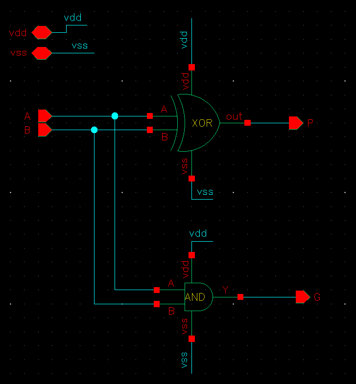
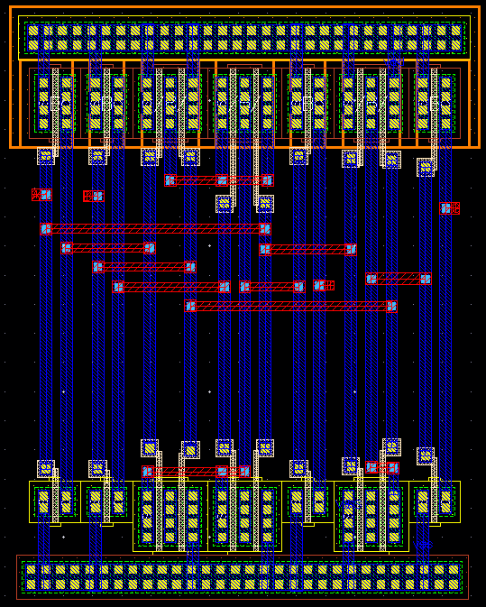
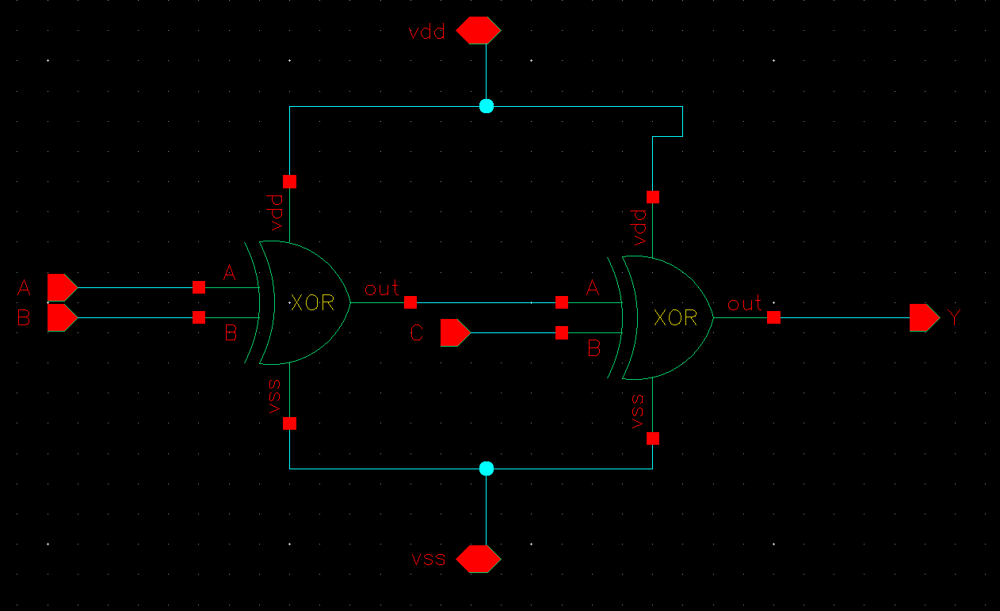
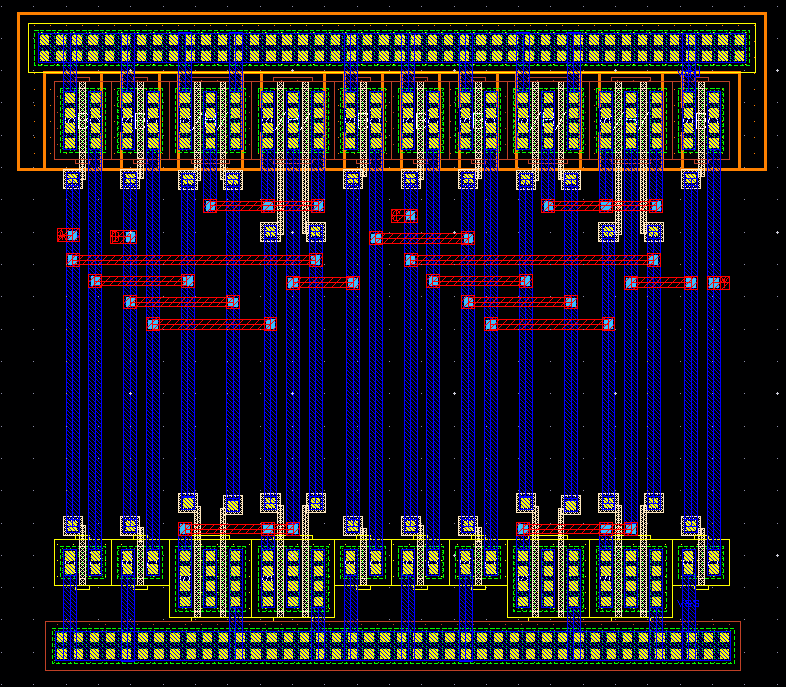
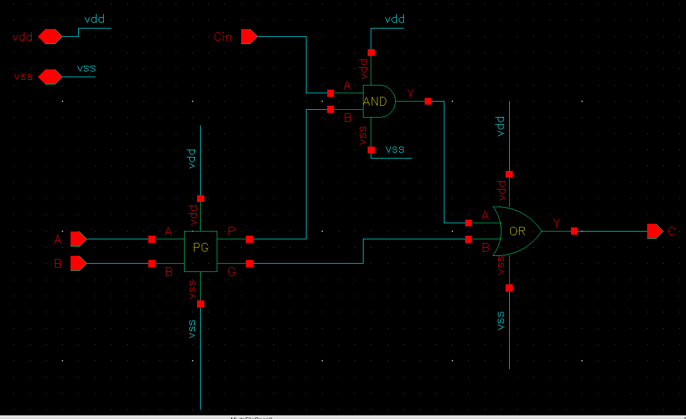
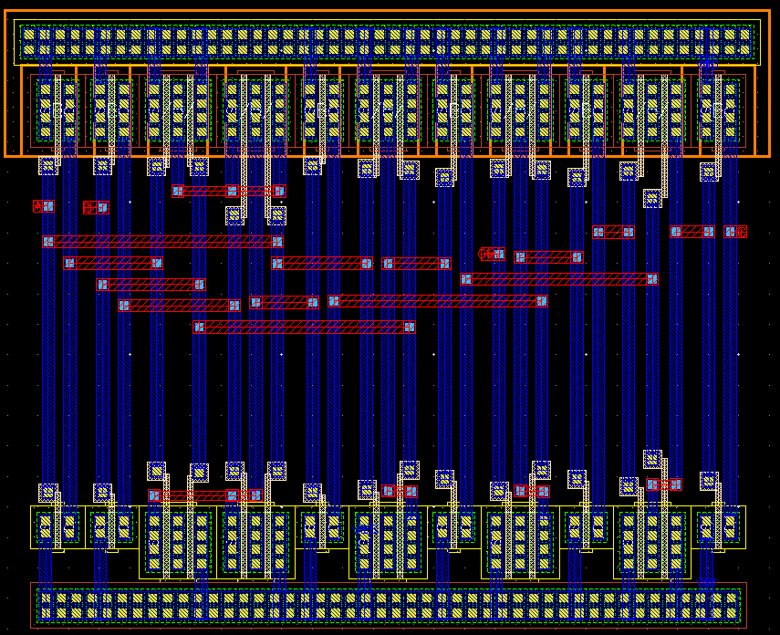
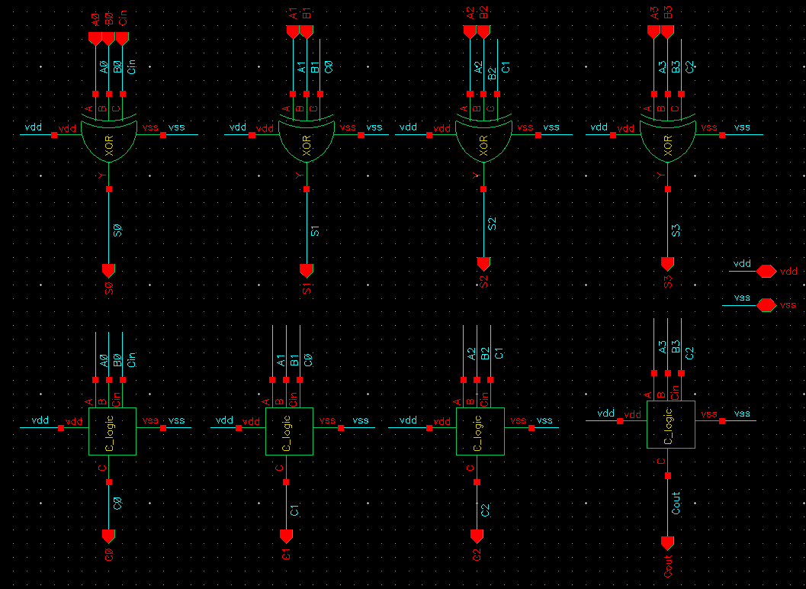
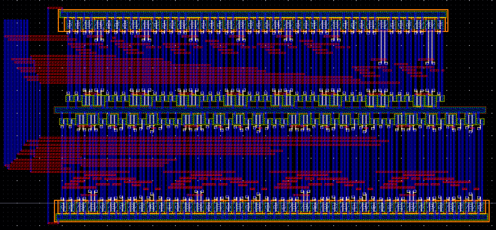

# 4-Bit Carry Lookahead Adder (CLA)
**Cadence Virtuoso · GPDK 180nm · Static CMOS · VDD = 1.8V**

---

## Overview

A **Carry Lookahead Adder (CLA)** is a fast binary adder that eliminates the carry propagation delay found in a Ripple Carry Adder (RCA). In an RCA, each bit must wait for the carry from the previous bit — so for a 4-bit adder, the last bit waits for 3 carries to ripple through. CLA solves this by computing all carries simultaneously using two pre-computed signals per bit.

This design is implemented at the gate level in **Cadence Virtuoso** using the **GPDK 180nm** process. Supply voltage is **VDD = 1.8V**, VSS = 0V. The adder is built from three custom cells: **PG**, **3-input XOR**, and **C_logic**.

---

## How CLA Works

For each bit position *i*, two signals are defined:

| Signal | Formula | Meaning |
|--------|---------|---------|
| Propagate (P) | `Pᵢ = Aᵢ ⊕ Bᵢ` | Carry will pass through this bit if one input is 1 |
| Generate (G) | `Gᵢ = Aᵢ · Bᵢ` | Carry is created at this bit if both inputs are 1 |

Using P and G, all carry bits are computed at once — no waiting:

```
C0 = Cin
C1 = G0 + P0·Cin
C2 = G1 + P1·G0 + P1·P0·Cin
C3 = G2 + P2·G1 + P2·P1·G0 + P2·P1·P0·Cin
Cout = G3 + P3·G2 + P3·P2·G1 + P3·P2·P1·G0 + P3·P2·P1·P0·Cin
```

The sum for each bit is:  `Sᵢ = Aᵢ ⊕ Bᵢ ⊕ Cᵢ`

Since all carries are ready at the same time, all sum bits compute together — giving the CLA a much shorter critical path than an RCA.

---

## Cell 1 — PG Logic

### What it does

Takes two 1-bit inputs A and B and produces two outputs:
- **P (Propagate) = A ⊕ B** — built with an XOR gate
- **G (Generate) = A · B** — built with an AND gate

These two signals feed both the carry logic and the sum logic of each bit slice.

### Schematic



The XOR gate and AND gate operate in parallel on the same A and B inputs. Both cells are powered at **VDD = 1.8V**.

### Truth Table

| A | B | P = A ⊕ B | G = A · B | Meaning |
|---|---|-----------|-----------|---------|
| 0 | 0 | 0 | 0 | No carry in, no carry out |
| 0 | 1 | 1 | 0 | Carry propagates if Cin = 1 |
| 1 | 0 | 1 | 0 | Carry propagates if Cin = 1 |
| 1 | 1 | 0 | 1 | Carry always generated |

- If **G = 1**: a carry is always produced at this bit, regardless of Cin
- If **P = 1, G = 0**: a carry passes through only if Cin = 1
- If **P = 0, G = 0**: no carry is produced or passed

### Layout



XOR and AND cells placed side by side. VDD rail at top, VSS at bottom. Signal routing in Metal 1.

---

## Cell 2 — 3-Input XOR (Sum Logic)

### What it does

Computes the final sum bit for each position:

```
S = A ⊕ B ⊕ Cin
```

In the adder context: A and B are the operand bits, and Cin is the lookahead carry for that bit position.

### Schematic



Since a single 3-input XOR is not available as a primitive, it is built from **two cascaded 2-input XOR gates**:

- **Stage 1:** First XOR computes `A ⊕ B`
- **Stage 2:** Second XOR takes that result and computes `(A ⊕ B) ⊕ Cin = S`

Both stages are powered at **VDD = 1.8V** with shared power rails.

### Truth Table

| A | B | Cin | A ⊕ B | S = A ⊕ B ⊕ Cin |
|---|---|-----|-------|-----------------|
| 0 | 0 | 0 | 0 | **0** |
| 0 | 0 | 1 | 0 | **1** |
| 0 | 1 | 0 | 1 | **1** |
| 0 | 1 | 1 | 1 | **0** |
| 1 | 0 | 0 | 1 | **1** |
| 1 | 0 | 1 | 1 | **0** |
| 1 | 1 | 0 | 0 | **0** |
| 1 | 1 | 1 | 0 | **1** |

The output S = 1 when an **odd number** of inputs are 1. This is exactly the sum bit of a full adder.

### Layout



Two XOR instances placed side by side. The output of the first XOR is routed directly into input A of the second XOR via Metal 1.

---

## Cell 3 — Carry Logic (C_logic)

### What it does

Computes the carry-out for each bit using the P and G signals:

```
Cout = G + P · Cin
```

- If G = 1 → carry is generated, Cout = 1 regardless of Cin
- If P = 1 and Cin = 1 → carry propagates, Cout = 1
- Otherwise → Cout = 0

### Schematic



Implemented with:
- **AND gate** → computes `P · Cin`
- **OR gate** → computes `G + (P · Cin)` → this is Cout

Powered at **VDD = 1.8V**. P and G come from the PG cell; Cin is the lookahead carry from the previous stage.

### Truth Table

| G | P | Cin | P · Cin | Cout = G + P·Cin |
|---|---|-----|---------|-----------------|
| 0 | 0 | 0 | 0 | **0** |
| 0 | 0 | 1 | 0 | **0** |
| 0 | 1 | 0 | 0 | **0** |
| 0 | 1 | 1 | 1 | **1** |
| 1 | 0 | 0 | 0 | **1** |
| 1 | 0 | 1 | 0 | **1** |
| 1 | 1 | 0 | 0 | **1** |
| 1 | 1 | 1 | 1 | **1** |

### Layout



AND and OR gates placed compactly. The carry output C is routed to the next bit's Cin in the top-level schematic.

---

## Top-Level CLA Adder

### Schematic



The top-level instantiates 4 identical bit slices (bit 0 → bit 3). Each slice contains one 3-input XOR and one C_logic cell. The PG cell for each bit feeds both. Carry from each C_logic feeds the next slice's Cin.

**Signal flow per bit slice:**

```
A[i], B[i]
    │
  [PG Cell] ──── P[i], G[i]
    │                  │
    │         ┌────────┴────────┐
    │         ▼                 ▼
    │    [C_logic]         [3-in XOR]
    │         │                 │
    │       C[i+1]            S[i]
    │    (to next slice)    (sum output)
```

**Ports:**

| Port | Direction | Description |
|------|-----------|-------------|
| A[3:0] | Input | First 4-bit operand |
| B[3:0] | Input | Second 4-bit operand |
| Cin | Input | Carry-in at bit 0 |
| S[3:0] | Output | 4-bit sum result |
| Cout | Output | Final carry-out |

---

## Full Layout



All four bit-slices placed and routed in Cadence Virtuoso. Power rails (VDD = 1.8V) run horizontally at the top of each row, VSS at the bottom. Signal interconnects use Metal 1 (horizontal) and Metal 2 (vertical).

- **DRC** — Passed (no design rule violations)
- **LVS** — Passed (layout matches schematic netlist)

---

## Tools & Specifications

| | |
|---|---|
| EDA Tool | Cadence Virtuoso |
| PDK | GPDK 180nm CMOS |
| VDD | 1.8 V |
| VSS | 0 V (Ground) |
| Logic Style | Static CMOS |
| Verification | DRC, LVS |

---

*Designed by Raghul — Digital VLSI, GPDK 180nm*
